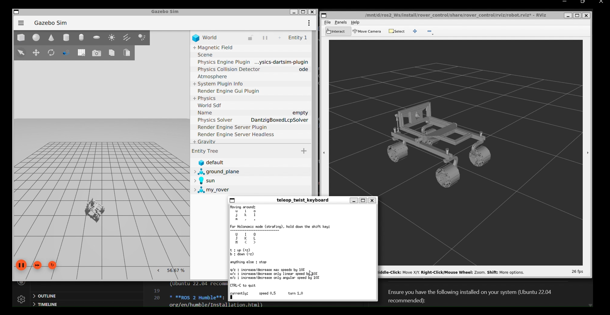

# 🤖 Rover Control Simulation Package

A ROS 2 Humble package for simulating, controlling, and visualizing a custom 4-wheel steering rover. This project integrates **Gazebo (GZ Sim)** for physics simulation, **RViz2** for visualization, and **ros2_control** for hardware abstraction.

## 📋 Overview

Complete Simulation Video ---> https://youtu.be/wDraLFhGKr0?si=rXpDjUlhH6Pqaa2B


This package provides a complete simulation pipeline for a "Mars Rover" style robot. It features a chassis with 4 independent steering modules and 4 driving wheels.

**Key Features:**

* **Full Simulation Loop:** URDF  Gazebo  ROS 2 Control  RViz.
* **4-Wheel Independent Steering:** The URDF is configured with revolute joints for steering (`steer1` - `steer4`) and continuous joints for driving (`wheel_1` - `wheel_4`).
* **Custom Teleop Bridge:** Includes a Python node (`rover_teleop_bridge`) to convert standard `Twist` messages into specific joint commands for the rover controller.
* **Automated Launch:** A single master launch file handles simulation spawning, controller activation, and visualization.

## ⚙️ Prerequisites

Ensure you have the following installed on your system (Ubuntu 22.04 recommended):

* **ROS 2 Humble**: [Installation Guide](https://docs.ros.org/en/humble/Installation.html)
* **Gazebo (GZ Sim)**: Compatible version (Garden/Harmonic).
* **ROS GZ Dependencies**:
```bash
sudo apt install ros-humble-ros-gz
sudo apt install ros-humble-ros2-control ros-humble-ros2-controllers ros-humble-gz-ros2-control
sudo apt install ros-humble-xacro ros-humble-joint-state-publisher-gui
sudo apt install xterm # Required for the pop-up teleop window

```


## 🚀 Installation

1. **Create a ROS 2 Workspace:**
```bash
mkdir -p ~/rover_ws/src
cd ~/rover_ws/src

```


2. **Clone the Repository:**
```bash
git clone https://github.com/jasvirsingh1711/rover_control.git

```


3. **Install Dependencies:**
```bash
cd ~/rover_ws
rosdep install --from-paths src -y --ignore-src

```


4. **Build the Package:**
```bash
colcon build --symlink-install
source install/setup.bash

```


## 🎮 Usage

### 1. Main Simulation (Master Launch)

This is the primary command to run the full simulation. It launches Gazebo, spawns the robot, starts the controllers, opens RViz, and pops up a keyboard control window.

```bash
ros2 launch rover_control master.launch.py

```

**What happens when you run this?**

1. **Gazebo Starts:** An empty world is loaded.
2. **Robot Spawns:** The `rover.urdf` is processed and spawned at `z=0.5`.
3. **Controllers Activate:** The `joint_state_broadcaster` and `rover_controller` are spawned automatically once the simulation is ready.
4. **Bridge Active:** A custom `rover_teleop_bridge` starts to translate commands.
5. **Control:** A dedicated `xterm` window opens running `teleop_twist_keyboard` for manual control.

### 2. URDF Visualization (Debug Mode)

If you only want to inspect the robot model and joint limits without running the heavy physics simulation:

```bash
ros2 launch rover_control display.launch.py

```

* Opens **RViz2**.
* Opens **Joint State Publisher GUI** (allows you to move wheels/steering manually with sliders).

## 📂 Project Structure

```text
rover_control/
├── config/
│   └── my_controllers.yaml   # ROS 2 Control configuration (PID, Joint groups)
├── launch/
│   ├── master.launch.py      # Main simulation orchestrator
│   └── display.launch.py     # RViz-only visualizer
├── meshes/                   # STL files for Chassis, Steering, and Wheels
├── rviz/
│   └── robot.rviz            # Saved RViz configuration
├── urdf/
│   └── rover.urdf            # Robot description with gz_ros2_control plugin
├── rover_control/
│   └── rover_teleop_bridge.py # Custom node mapping Twist -> Controller
├── package.xml
└── CMakeLists.txt / setup.py

```

## 🧠 Architecture Details

### The Robot Model (`rover.urdf`)

The robot is defined using standard URDF with the following hierarchy:

* **Base:** `base_link` / `chassis`
* **Steering:** 4x Revolute joints (`steer1`, `steer2`, `steer_3`, `steer4`) with limits [-1.57, 1.57].
* **Wheels:** 4x Continuous joints (`wheel_1`, `wheel_2`, `wheel_3`, `wheel_4`).

The URDF includes the `<ros2_control>` tag utilizing the `gz_ros2_control` plugin, exposing **position** and **velocity** interfaces for all 8 joints.

### The Control Loop

1. **Input:** User presses keys in `teleop_twist_keyboard` (publishes `/cmd_vel`).
2. **Processing:** The `rover_teleop_bridge` node subscribes to `/cmd_vel`.
3. **Calculation:** The bridge calculates the necessary wheel speeds and steering angles (Ackermann or Skid steer logic depending on implementation).
4. **Command:** The bridge publishes commands to the `rover_controller`.
5. **Actuation:** Gazebo executes the physics based on these commands.

## 🛠 Troubleshooting

* **Models not appearing?** Ensure your `meshes` folder is correctly populated and the paths in URDF (`package://rover_control/meshes/...`) are correct.
* **"Waiting for service..." errors?** This is normal during startup. The `RegisterEventHandler` in `master.launch.py` ensures controllers only start *after* the robot is spawned.
* **Teleop window didn't open?** Ensure `xterm` is installed (`sudo apt install xterm`).
